
<h1 align="center">实验室耗材管理系统设计与实现</h1>

## 简介
实验室耗材管理系统：角色分为管理员、用户；功能包括实验材料管理、申请管理、教师/学生信息管理及耗材统计，支持信息录入、修改、查询、审核等功能，界面简洁易用。    --计算机毕业设计源码；毕设源码；java毕业设计源码

## 联系方式

<h3 align="center">获取完整代码与数据库文件 + 微信：deepguan QQ: 86050149 QQ群: 783742310</h3>

<h3 align="center">可帮忙远程部署 包运行成功！提供远程部署、修改代码、设计文档指导、代码讲解等服务！</h3>

## 功能介绍（完整见运行截图）
管理员：基本功能包括登录、退出、以及个人信息查看与修改。管理实验耗材信息，支持数据的添加、修改、删除、批量操作等功能；审核学生及教师耗材申请，管理教师和学生的账户信息；查看耗材使用统计，并支持数据导出、打印等操作；系统导航栏提供各类

## 运行截图
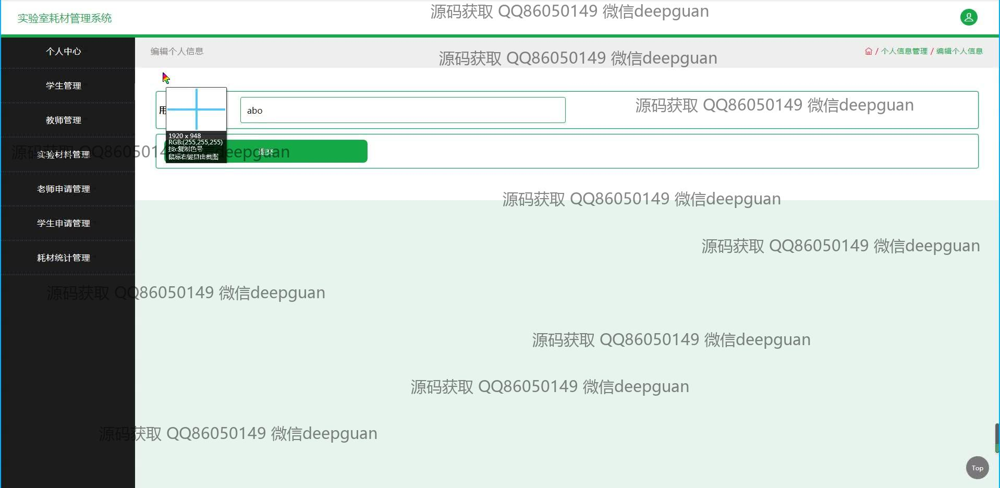
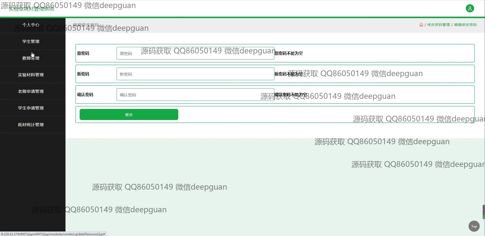
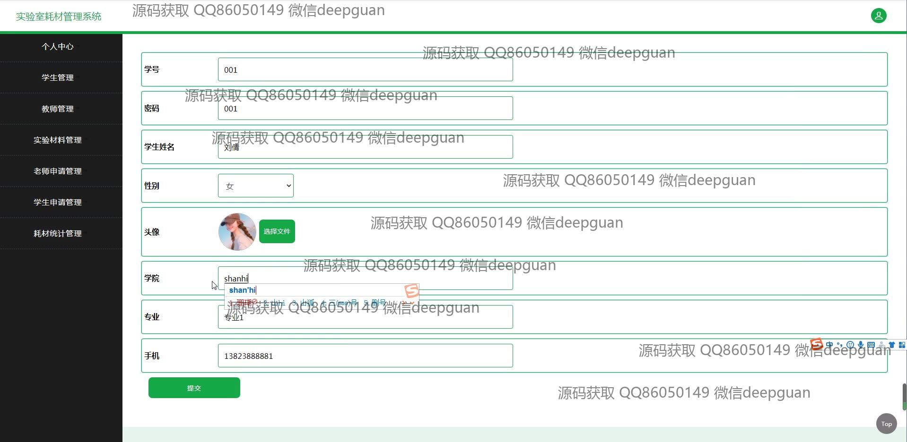
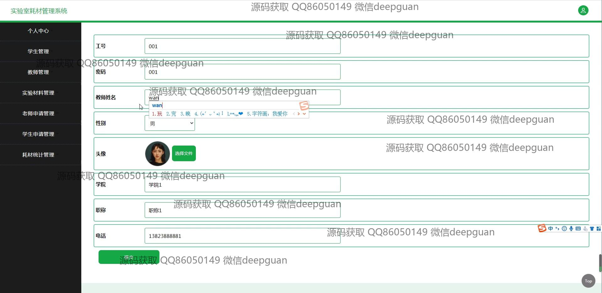
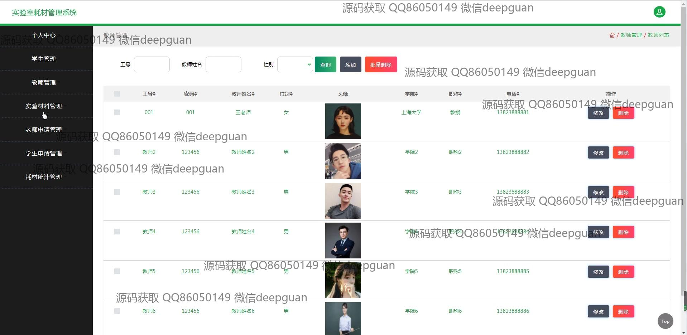
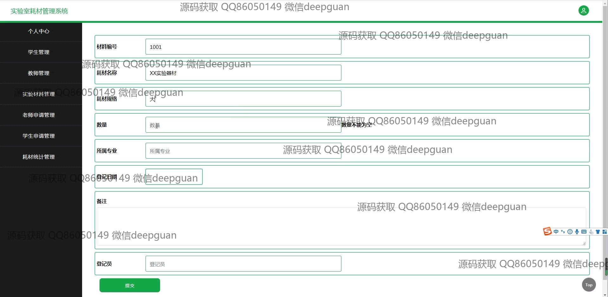
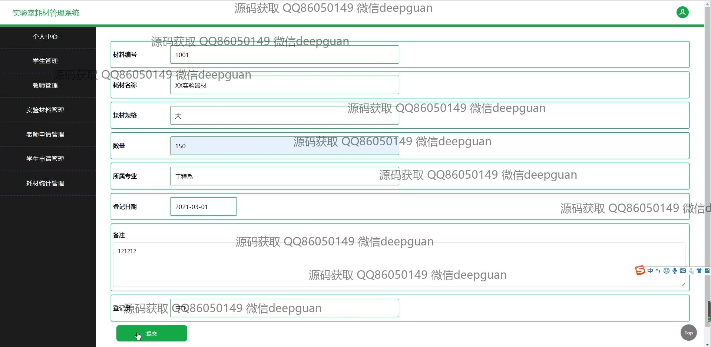
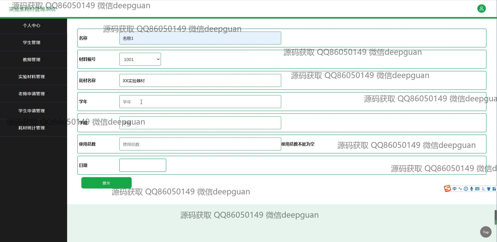
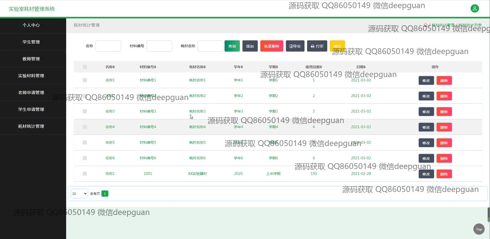
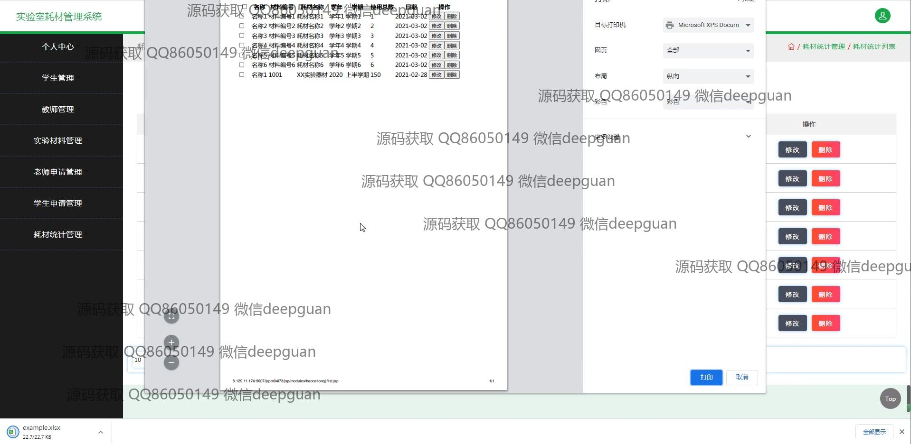
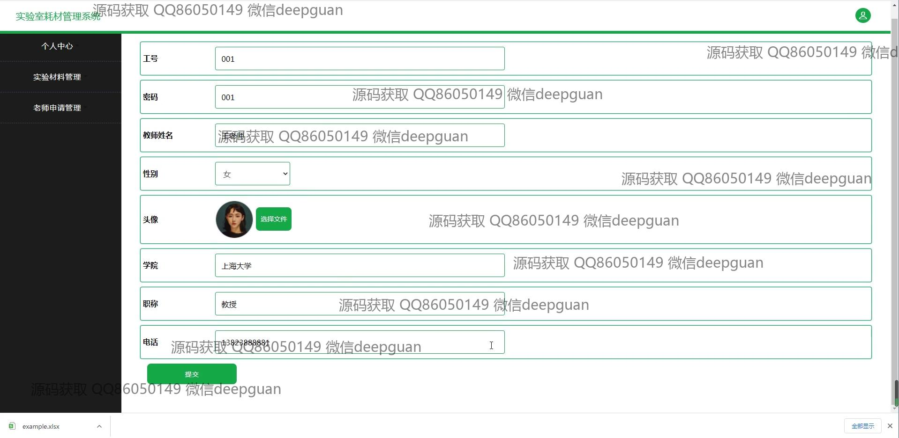
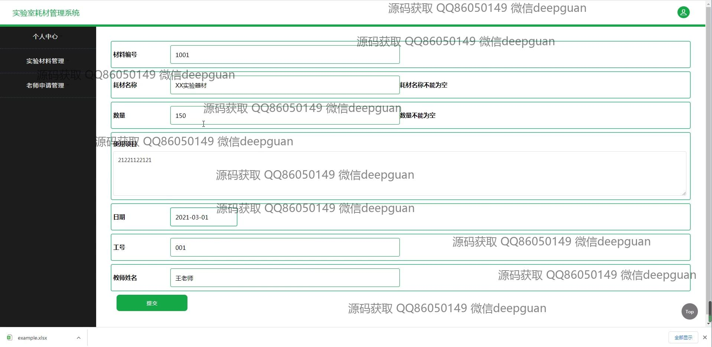
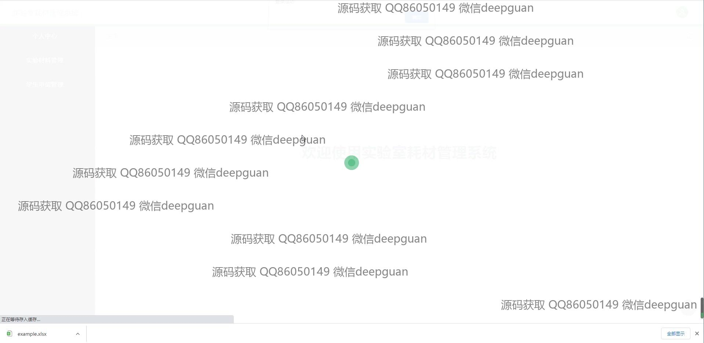

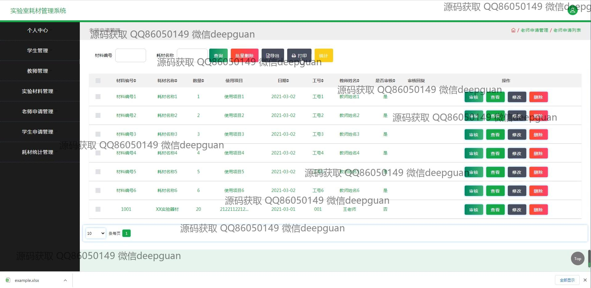
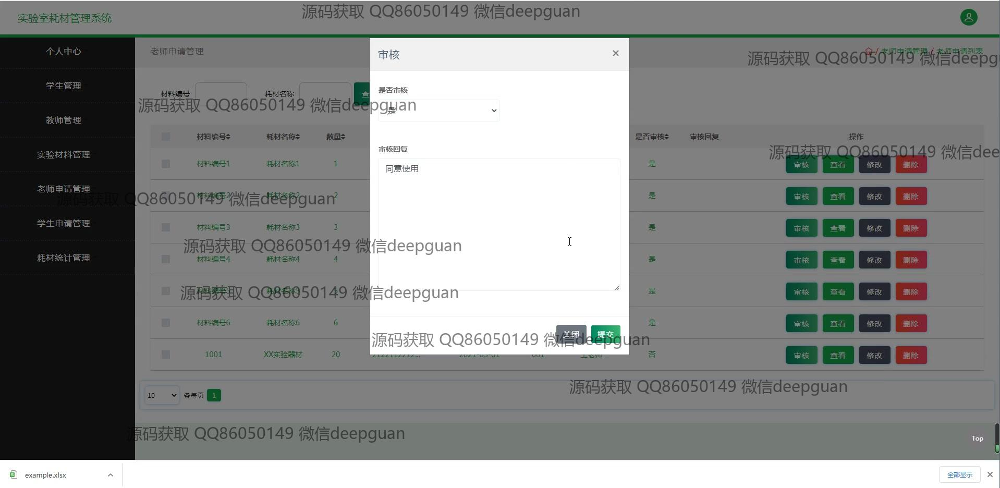

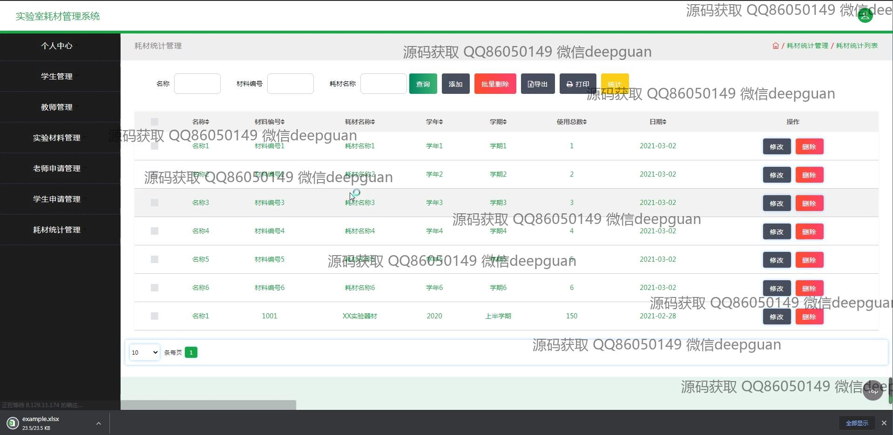

本代码来源于网络,仅供学习参考使用!

